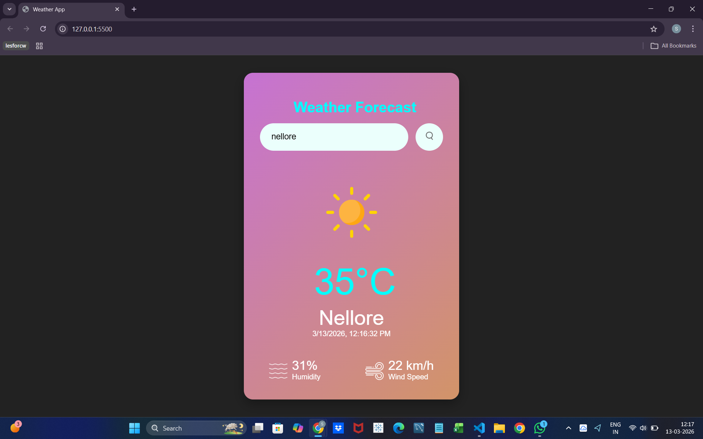

# Weather Forecast Web Application

A simple and responsive Weather Forecast Web Application built using HTML, CSS, and JavaScript that fetches real-time weather data using the OpenWeatherMap API.

This application allows users to search for any city and instantly view its current weather conditions including temperature, humidity, and wind speed.

## Features

- Search weather by city name
- Displays real-time temperature
- Shows humidity percentage
- Shows wind speed in km/h
- Dynamic weather icons based on weather condition
- Error handling for invalid city names
- Supports both Search Button and Enter Key
- Responsive UI design

## Technologies Used

- HTML5 – Structure of the application
- CSS3 – Styling and layout
- JavaScript (ES6) – Logic and API integration
- OpenWeatherMap API – Real-time weather data

## Project Structure

Weather-Forecast-Web-Application
│
├── index.html
├── styles.css
├── script.js
│
└── images
    ├── clear.png
    ├── clouds.png
    ├── drizzle.png
    ├── humidity.png
    ├── mist.png
    ├── rain.png
    ├── snow.png
    ├── wind.png
    └── search.png

## How It Works

- User enters a city name in the search box.
- The application sends a request to the OpenWeatherMap API.
- The API returns real-time weather data in JSON format.
- JavaScript extracts important information such as:
  - Temperature
  - Humidity
  - Wind Speed
- The UI updates dynamically to display the weather details.
- If the city name is invalid, an error message is shown.

## API Integration

This project uses the OpenWeatherMap API to retrieve real-time weather data.

Before running the project, replace the API key in script.js with your own key from:
https://openweathermap.org/api

## Screenshot

## Learning Outcomes

Through this project I learned:

- How to work with REST APIs
- Fetching data using JavaScript Fetch API
- Handling asynchronous functions
- DOM manipulation
- Error handling in web applications
- Building responsive UI with CSS

## Future Improvements

- Add 5-day weather forecast
- Detect user location automatically
- Add more weather conditions icons
- Improve UI animations

## Author

Chandra Sai Sahithi
